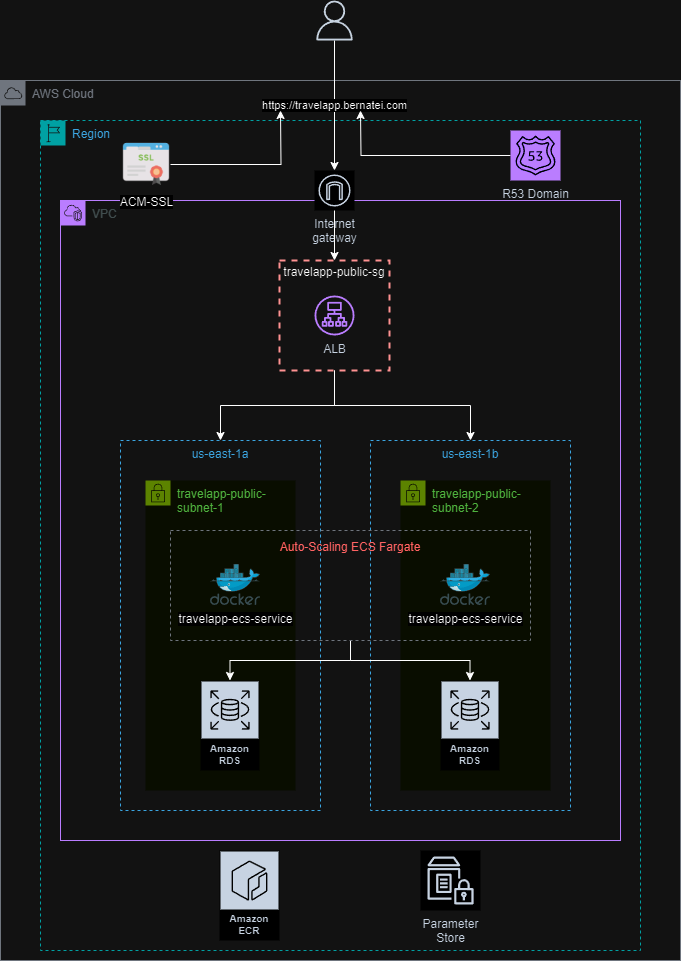

# Travel App Project

### Introduction:
This project it's based in [rossxross DevOps Bootcamp 2023, Travel-App Challenge](https://github.com/roxsross/bootcamp-devops-2023/tree/clase2-linux-bash/app-295devops-travel).

 The primary objective of the challenge is to deploy a PHP application (travel-app) on AWS, leveraging services like ECS, RDS, VPC, ACM, R53, LB, and more. The deployment process is automated through Github Actions workflows. 

# Core Services
### VPC
1. One VPC called "travelapp-vpc".
2. Two Subnets (travelapp-public-subnet-1
 & travelapp-public-subnet-2
) with default ACLs.
3. One Internet Gateway ("travelapp-igw").
4. One Route table with a local route & IGW route.
5. One security group called "travelapp-public-sg" with two inbound rules (allowing http & https requests) and one outbound rule (allowing all outbound traffic). It's gonna be used by "travelapp-alb".
6. A second security group for the RDS, called "travelapp-rds-public-sg". With one inbound rule to allow connections to the RDS.
### R53
1. One subdomain called "travelapp.bernatei.com" of type A(lias) record that points to the ALB.
### ACM
1. One SSL certificate for "travelapp.bernatei.com".
### Parameter Store
1. Database variables so that ECS containers can connect to the RDS.
### RDS
1. One MYSQL RDS called "travelapprds".
### ALB
1. One Application LoadBalancer which will be listening for 'http/https' requests from the r53 domain (travelapp.bernatei.com) then forwarding this requests to the Target group ("travelapp-tg").
2. One Target Group ("travelapp-tg") that redirects the requests to the registered targets (ecs-fargate machines) at port 80.
### ECR
1. One ECR Repository called "travelapp-ecr".
### ECS
1. One ECS Cluster named "travelapp-cluster"
2. One ECS Task, "travelapp-taskdefintion", that defines container settings like it's name, image to utilize, cpu/memory, containerPort/hostPort, network mode, fargate use, OS, etc.
3. One ECS Service, "travelapp-service", which utilizes the ECS Task definitions to deploy the container into the cluster.
4. ECS Task role called "ECS-TravelApp-Role", so that ECS has permissions over ECR, Cloudwatch, SSM, KMS.

### Workflows
1. The main objective of the "terraform.yaml" workflow is to automate the deployment of AWS resources. When a pull request is created, it triggers a terraform plan to check the changes. If all changes are approved and the pull request is merged, the workflow executes a terraform apply.
2. The second workflow, "ecs.yaml," automates the deployment of new images to the ECS cluster. When a change is detected in the path: "app-295devops-travel/**", the workflow automatically builds, tags, and pushes a new image to ECR. Once the new image is stored in ECR, the workflow downloads the latest ECS task definition and updates it with the latest image tag. Finally, the workflow updates the ECS service to use the newly created ECS task definition, which deploys the container to the cluster.
3. The third workflow, "terraform-docs.yaml", renders docs for each terraform module inside a README.MD and pushes the changes back to the PR.

### Extras
1. I utilized SOPS + AWS KMS to encrypt the database variables from plain view.
2. I implemented the use of OIDC credentials for setting up aws credentials in each gh actions workflow.